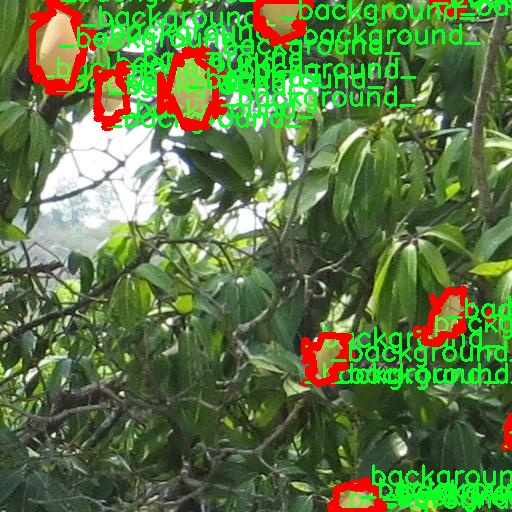

# 芒果图像分割系统源码＆数据集分享
 [yolov8-seg-CSwinTransformer＆yolov8-seg-efficientViT等50+全套改进创新点发刊_一键训练教程_Web前端展示]

### 1.研究背景与意义

项目参考[ILSVRC ImageNet Large Scale Visual Recognition Challenge](https://gitee.com/YOLOv8_YOLOv11_Segmentation_Studio/projects)

项目来源[AAAI Global Al lnnovation Contest](https://kdocs.cn/l/cszuIiCKVNis)

研究背景与意义

随着计算机视觉技术的快速发展，图像分割作为其重要的研究方向之一，已经在多个领域中得到了广泛应用。尤其是在农业领域，图像分割技术能够有效地帮助农民和研究人员对作物进行监测、管理和分析。芒果作为一种重要的热带水果，其生长、成熟和采摘过程中的监测对于提高产量和质量具有重要意义。然而，传统的人工识别和分割方法不仅耗时耗力，而且容易受到主观因素的影响，难以保证准确性。因此，基于深度学习的自动化图像分割技术应运而生，成为了当前研究的热点。

在众多图像分割算法中，YOLO（You Only Look Once）系列模型因其高效性和实时性而备受关注。YOLOv8作为该系列的最新版本，进一步提升了目标检测和分割的精度与速度。通过改进YOLOv8模型，我们可以针对芒果图像进行更加精确的实例分割，从而实现对芒果的自动识别和分类。具体而言，本研究将利用包含1500张图像的芒果数据集，该数据集涵盖了两类目标：背景和芒果。这一数据集的构建为模型的训练和验证提供了坚实的基础，使得研究能够在较为丰富的样本上进行。

在农业生产中，芒果的生长周期受到多种因素的影响，包括气候、土壤和病虫害等。通过对芒果图像的精确分割，我们能够实现对其生长状态的实时监测，及时发现潜在问题并采取相应措施。这不仅有助于提高芒果的产量和质量，还能为农民提供科学的决策依据。此外，基于改进YOLOv8的芒果图像分割系统还可以应用于智能农业管理系统中，实现自动化的作物监测和管理，提升农业生产的智能化水平。

从学术研究的角度来看，基于YOLOv8的芒果图像分割系统的构建，不仅丰富了图像分割领域的研究内容，也为深度学习在农业领域的应用提供了新的思路和方法。通过对该系统的研究，我们可以深入探讨深度学习模型在特定领域的适应性和有效性，为后续的研究提供借鉴。同时，本研究也为相关领域的研究者提供了一个可供参考的案例，推动了计算机视觉技术在农业领域的进一步发展。

综上所述，基于改进YOLOv8的芒果图像分割系统的研究具有重要的理论价值和实际意义。它不仅为芒果的生长监测提供了高效的技术手段，也为农业智能化发展提供了新的解决方案。通过这一研究，我们期望能够推动图像分割技术在农业领域的广泛应用，为实现农业的可持续发展贡献力量。

### 2.图片演示


##### 注意：由于此博客编辑较早，上面“2.图片演示”和“3.视频演示”展示的系统图片或者视频可能为老版本，新版本在老版本的基础上升级如下：（实际效果以升级的新版本为准）

  （1）适配了YOLOV8的“目标检测”模型和“实例分割”模型，通过加载相应的权重（.pt）文件即可自适应加载模型。

  （2）支持“图片识别”、“视频识别”、“摄像头实时识别”三种识别模式。

  （3）支持“图片识别”、“视频识别”、“摄像头实时识别”三种识别结果保存导出，解决手动导出（容易卡顿出现爆内存）存在的问题，识别完自动保存结果并导出到tempDir中。

  （4）支持Web前端系统中的标题、背景图等自定义修改，后面提供修改教程。

  另外本项目提供训练的数据集和训练教程,暂不提供权重文件（best.pt）,需要您按照教程进行训练后实现图片演示和Web前端界面演示的效果。

### 3.视频演示

[3.1 视频演示](https://www.bilibili.com/video/BV1jtmMYCEah/)

### 4.数据集信息展示

##### 4.1 本项目数据集详细数据（类别数＆类别名）

nc: 2
names: ['_background_', 'mango']


##### 4.2 本项目数据集信息介绍

数据集信息展示

在本研究中，我们使用了名为“mango”的数据集，旨在改进YOLOv8-seg模型在芒果图像分割任务中的表现。该数据集的设计与构建专注于提供高质量的图像数据，以支持深度学习模型的训练和验证。数据集的类别数量为2，具体类别包括“_background_”和“mango”。这种简单而明确的类别划分，使得模型能够有效地区分背景与目标对象，从而提高分割精度。

“mango”数据集包含多样化的芒果图像，涵盖了不同的生长阶段、品种、光照条件和背景环境。这种多样性不仅增强了模型的泛化能力，还确保了其在实际应用中的鲁棒性。每张图像都经过精心标注，确保了芒果与背景的清晰分离。标注过程中采用了专业的图像标注工具，确保了每个像素的准确性，从而为模型的训练提供了可靠的基础。

在数据集的构建过程中，我们特别关注了图像的质量和多样性。数据集中的图像不仅包括了成熟的芒果，还涵盖了未成熟和过熟的芒果，反映了芒果在不同生长阶段的特征。此外，图像的拍摄环境也各不相同，包括自然光照、阴影和不同的背景，这些因素都可能影响模型的识别能力。因此，数据集的多样性为模型的训练提供了丰富的样本，有助于提高其在复杂环境下的表现。

为了进一步增强模型的鲁棒性，我们在数据集中引入了一些数据增强技术。这些技术包括随机裁剪、旋转、翻转以及颜色变换等，旨在模拟不同的拍摄条件和角度，从而使模型能够更好地适应现实世界中的变化。这种数据增强策略不仅增加了训练样本的数量，还提高了模型的学习能力，使其能够在面对未见过的图像时，依然保持较高的分割精度。

在训练过程中，我们将“mango”数据集分为训练集和验证集，以便于评估模型的性能。训练集用于模型的学习，而验证集则用于监测模型在未见数据上的表现。通过这种方式，我们能够及时调整模型的参数和结构，以达到最佳的分割效果。

总之，“mango”数据集为改进YOLOv8-seg的芒果图像分割系统提供了坚实的基础。其丰富的图像样本和高质量的标注，结合数据增强技术的应用，确保了模型在不同条件下的适应性和准确性。随着研究的深入，我们期待该数据集能够推动芒果图像分割技术的发展，为农业生产和管理提供更为智能化的解决方案。





### 5.全套项目环境部署视频教程（零基础手把手教学）

[5.1 环境部署教程链接（零基础手把手教学）](https://www.bilibili.com/video/BV1jG4Ve4E9t/?vd_source=bc9aec86d164b67a7004b996143742dc)


[5.2 安装Python虚拟环境创建和依赖库安装视频教程链接（零基础手把手教学）](https://www.bilibili.com/video/BV1nA4VeYEze/?vd_source=bc9aec86d164b67a7004b996143742dc)

### 6.手把手YOLOV8-seg训练视频教程（零基础小白有手就能学会）

[6.1 手把手YOLOV8-seg训练视频教程（零基础小白有手就能学会）](https://www.bilibili.com/video/BV1cA4VeYETe/?vd_source=bc9aec86d164b67a7004b996143742dc)


按照上面的训练视频教程链接加载项目提供的数据集，运行train.py即可开始训练



     Epoch   gpu_mem       box       obj       cls    labels  img_size
     1/200     0G   0.01576   0.01955  0.007536        22      1280: 100%|██████████| 849/849 [14:42<00:00,  1.04s/it]
               Class     Images     Labels          P          R     mAP@.5 mAP@.5:.95: 100%|██████████| 213/213 [01:14<00:00,  2.87it/s]
                 all       3395      17314      0.994      0.957      0.0957      0.0843

     Epoch   gpu_mem       box       obj       cls    labels  img_size
     2/200     0G   0.01578   0.01923  0.007006        22      1280: 100%|██████████| 849/849 [14:44<00:00,  1.04s/it]
               Class     Images     Labels          P          R     mAP@.5 mAP@.5:.95: 100%|██████████| 213/213 [01:12<00:00,  2.95it/s]
                 all       3395      17314      0.996      0.956      0.0957      0.0845

     Epoch   gpu_mem       box       obj       cls    labels  img_size
     3/200     0G   0.01561    0.0191  0.006895        27      1280: 100%|██████████| 849/849 [10:56<00:00,  1.29it/s]
               Class     Images     Labels          P          R     mAP@.5 mAP@.5:.95: 100%|███████   | 187/213 [00:52<00:00,  4.04it/s]
                 all       3395      17314      0.996      0.957      0.0957      0.0845


### 7.50+种全套YOLOV8-seg创新点代码加载调参视频教程（一键加载写好的改进模型的配置文件）

[7.1 50+种全套YOLOV8-seg创新点代码加载调参视频教程（一键加载写好的改进模型的配置文件）](https://www.bilibili.com/video/BV1Hw4VePEXv/?vd_source=bc9aec86d164b67a7004b996143742dc)

### 8.YOLOV8-seg图像分割算法原理

原始YOLOv8-seg算法原理

YOLOv8-seg算法是Ultralytics团队在2023年1月推出的一项重要进展，基于YOLOv5的架构并结合了近两年内在目标检测领域中经过验证的多项创新。YOLOv8-seg不仅延续了YOLO系列模型的高效性和准确性，还在图像分割任务中引入了新的思路和技术，旨在提升模型在复杂场景下的表现。其设计理念是快速、准确且易于使用，使其成为广泛应用于目标检测、图像分割和图像分类的理想选择。

YOLOv8-seg的网络结构在输入层、主干网络、颈部网络和头部网络等多个方面进行了优化和改进。首先，在输入层，YOLOv8-seg默认接受640x640的图像尺寸，但在实际应用中，考虑到图像长宽比的多样性，模型采用自适应缩放策略。这种策略通过将图像的长边按比例缩小到指定尺寸，然后对短边进行填充，最大限度地减少信息冗余，提升了目标检测和推理的速度。此外，YOLOv8-seg在训练过程中引入了Mosaic数据增强技术，通过将四张不同的图像随机缩放并拼接，生成新的训练样本。这种方法有效地增强了模型的鲁棒性和泛化能力，尽管在训练的最后10个epoch中停止使用Mosaic增强，以避免对数据真实分布的干扰。

在主干网络方面，YOLOv8-seg采用了C2f模块替代了YOLOv5中的C3模块。C2f模块借鉴了YOLOv7中的ELAN设计理念，增加了更多的跳层连接，丰富了梯度流信息的获取。这种设计不仅提高了模型的表达能力，还在保持轻量化的同时，确保了更高的精度和更合理的延迟。与此同时，YOLOv8-seg依然保留了SPPF模块，以确保在减少执行时间的同时不影响性能。

在颈部网络中，YOLOv8-seg同样将所有的C3模块更改为C2f模块，并且去除了两处上采样之前的卷积连接层，直接将主干网络不同阶段输出的特征进行上采样。这一改进简化了网络结构，提高了特征传递的效率，进而增强了模型的整体性能。

头部网络是YOLOv8-seg中变化最大的部分，采用了解耦头的设计理念。与之前的耦合头不同，YOLOv8-seg将检测和分类任务分为两个并行的分支，分别提取类别和位置特征。这种分离使得分类任务可以更专注于特征图中的相似性分析，而定位任务则更关注边界框与真实框之间的关系。这种侧重点的不同使得模型在收敛速度和预测精度上都有了显著提升。

值得注意的是，YOLOv8-seg采用了无锚框的检测方法，摒弃了传统的基于锚框的思想。通过将目标检测转化为关键点检测，YOLOv8-seg避免了在训练前对锚框的预设，简化了模型的设计，增强了其泛化能力。这一创新使得YOLOv8-seg在处理不同尺寸和形状的目标时更加灵活，能够适应更广泛的应用场景。

在损失函数的设计上，YOLOv8-seg引入了任务对齐学习（Task Alignment Learning，TAL）的概念，以提高分类和定位的协同效果。通过将分类分数和IoU的高次幂乘积作为衡量任务对齐程度的指标，YOLOv8-seg能够在训练过程中更好地平衡分类和定位的损失，从而实现更优的检测性能。

在实际检测结果上，YOLOv8-seg在COCO数据集上的表现也显示出其优越性。通过对比不同尺寸的模型，YOLOv8-seg在参数量没有显著增加的情况下，取得了更高的mAP（mean Average Precision）值，证明了其在精度和速度上的优势。这使得YOLOv8-seg在实时性和准确性并重的任务中，尤其是在机器人垃圾分拣等应用场景中，展现出巨大的潜力。

综上所述，YOLOv8-seg算法通过一系列结构性改进和创新设计，提升了目标检测和图像分割的性能。其高效的网络结构、灵活的输入处理方式以及无锚框的检测方法，使得YOLOv8-seg在复杂场景下的应用前景广阔。随着技术的不断发展，YOLOv8-seg无疑将在目标检测领域引领新的潮流，为各类实际应用提供更为强大的支持。


### 9.系统功能展示（检测对象为举例，实际内容以本项目数据集为准）

图9.1.系统支持检测结果表格显示

  图9.2.系统支持置信度和IOU阈值手动调节

  图9.3.系统支持自定义加载权重文件best.pt(需要你通过步骤5中训练获得)

  图9.4.系统支持摄像头实时识别

  图9.5.系统支持图片识别

  图9.6.系统支持视频识别

  图9.7.系统支持识别结果文件自动保存

  图9.8.系统支持Excel导出检测结果数据


### 10.50+种全套YOLOV8-seg创新点原理讲解（非科班也可以轻松写刊发刊，V11版本正在科研待更新）

#### 10.1 由于篇幅限制，每个创新点的具体原理讲解就不一一展开，具体见下列网址中的创新点对应子项目的技术原理博客网址【Blog】：


[10.1 50+种全套YOLOV8-seg创新点原理讲解链接](https://gitee.com/qunmasj/good)

#### 10.2 部分改进模块原理讲解(完整的改进原理见上图和技术博客链接)【如果此小节的图加载失败可以通过CSDN或者Github搜索该博客的标题访问原始博客，原始博客图片显示正常】
### YOLOv8简介
YOLOv8目标检测算法继承了YOLOv1系列的思考,是一种新型端到端的目标检测算法,尽管现在原始检测算法已经开源,但是鲜有发表的相关论文.YOLOv8的网络结构如图所示,主要可分为Input输入端、Backbone骨干神经网络、Neck 混合特征网络层和Head预测层网络共4个部分.

YOLO目标检测算法是一种端到端的One-Slage 目标检测算法，其核心思想是将图像按区域分块进行预测。YOLO将输入图像按照32x32的大小划分成若干个网格，例如416x416的图像将被划分为13x13个网格。当目标物体的中心位于某个网格内时,该网格就会负责输出该物体的边界框和类别置信度。每个网格可以预测多个边界框和多个目标类别,这些边界框和类别的数量可以根据需要进行设置。YOLO算法的输出是一个特征图,包含了每个网格对应的边界框和类别置信度的信息呵。本文采用YOLO最新的YOLOv8模型，其是2022年底发布的最新YOLO系列模型，采用全新的SOTA模型，全新的网络主干结构,如图1所示。
整个网络分为Backbone 骨干网络部分和Head头部网络部分。YOLOv8汲取了前几代网络的优秀特性，骨干网络和 Neck部分遵循CSP的思想，将YOLOv5中的C3模块被替换成了梯度流更丰富C2模块,去掉YOLOv5中 PAN-FPN上采样阶段中的卷积结构,将Backbone不同阶段输出的特征直接送入了上采样操作,模型提供了N/S/M/L/X尺度的不同大小模型,能够满足不同领域业界的需求。本文基于YOLOv8模型设计番茄病虫害检测系统，通过配置模型参数训练番茄图像,得到能够用于部署应用的最优模型。


### 感受野注意力卷积（RFAConv)
#### 标准卷积操作回顾
标准的卷积操作是构造卷积神经网络的基本构件。它利用具有共享参数的滑动窗口提取特征信息，克服了全连通层构造神经网络固有的参数多、计算开销大的问题。设 X R∈C×H×W
表示输入特征图，其中C、H、W分别表示特征图的通道数、高度、宽度。为了清楚地演示卷积核的特征提取过程，我们使用 C = 1 的例子。从每个接受域滑块中提取特征信息的卷积运算可以表示为:


这里，Fi 表示计算后每个卷积滑块得到的值，Xi 表示每个滑块内对应位置的像素值，K表示卷积核，S表示卷积核中的参数个数，N表示接收域滑块的总数。可以看出，每个滑块内相同位置的 feature共享相同的参数Ki。因此，标准的卷积运算并不能捕捉到不同位置所带来的信息差异，这最终在一定程度上限制了卷积神经网络的性能。 

#### 空间注意力回顾
目前，空间注意机制是利用学习得到的注意图来突出每个特征的重要性。与前一节类似，这里以 C=1为例。突出关键特征的空间注意机制可以简单表述为:这里，Fi 表示加权运算后得到的值。xi 和Ai 表示输入特征图和学习到的注意图在不同位置的值，N为输入特征图的高和宽的乘积，表示像素值的总数。


#### 空间注意与标准卷积运算
将注意力机制整合到卷积神经网络中，可以提高卷积神经网络的性能。通过对标准卷积运算和现有空间注意机制的研究，我们认为空间注意机制有效地克服了卷积神经网络固有的参数共享的局限性。目前卷积神经网络中最常用的核大小是 1 × 1和3 × 3。在引入空间注意机制后，提取特征的卷积操作可以是 1 × 1或3 × 3卷积操作。为了直观地展示这个过程，在 1 × 1卷积运算的前面插入了空间注意机制。通过注意图对输入特征图(Re-weight“×”)进行加权运算，最后通过 1 × 1卷积运算提取接收域的滑块特征信息。整个过程可以简单地表示如下:


 这里卷积核K仅代表一个参数值。如果取A i× ki 的值作为一种新的卷积核参数，有趣的是它解决了 1×1卷积运算提取特征时的参数共享问题。然而，关于空间注意机制的传说到此结束。当空间注意机制被插入到3×3卷积运算前面时。具体情况如下:


如上所述，如果取A的值 i × ki (4)式作为一种新的卷积核参数，完全解决了大规模卷积核的参数共享问题。然而，最重要的一点是，卷积核在提取每个接受域滑块的特征时，会共享一些特征。换句话说，每个接收域滑块内都有一个重叠。仔细分析后会发现A12= a21， a13 = a22， a15 = a24……，在这种情况下，每个滑动窗口共享空间注意力地图的权重。因此，空间注意机制没有考虑整个接受域的空间特征，不能有效地解决大规模卷积核的参数共享问题。因此，空间注意机制的有效性受到限制。 

#### 创新空间注意力和标准卷积操作
该博客提出解决了现有空间注意机制的局限性，为空间处理提供了一种创新的解决方案。受RFA的启发，一系列空间注意机制被开发出来，可以进一步提高卷积神经网络的性能。RFA可以看作是一个轻量级即插即用模块，RFA设计的卷积运算(RFAConv)可以代替标准卷积来提高卷积神经网络的性能。因此，我们预测空间注意机制与标准卷积运算的结合将继续发展，并在未来带来新的突破。
接受域空间特征:为了更好地理解接受域空间特征的概念，我们将提供相关的定义。接收域空间特征是专门为卷积核设计的，并根据核大小动态生成。如图1所示，以3×3卷积核为例。在图1中，“Spatial Feature”指的是原始的Feature map。“接受域空间特征”是空间特征变换后的特征图。

 

由不重叠的滑动窗口组成。当使用 3×3卷积内核提取特征时，接收域空间特征中的每个 3×3大小窗口代表一个接收域滑块。接受域注意卷积(RFAConv):针对接受域的空间特征，我们提出了接受域注意卷积(RFA)。该方法不仅强调了接收域滑块内不同特征的重要性，而且对接收域空间特征进行了优先排序。通过该方法，完全解决了卷积核参数共享的问题。接受域空间特征是根据卷积核的大小动态生成的，因此，RFA是卷积的固定组合，不能与卷积操作的帮助分离，卷积操作同时依赖于RFA来提高性能，因此我们提出了接受场注意卷积(RFAConv)。具有3×3大小的卷积核的RFAConv整体结构如图所示。


目前，最广泛使用的接受域特征提取方法是缓慢的。经过大量的研究，我们开发了一种快速的方法，用分组卷积来代替原来的方法。具体来说，我们利用相应大小的分组卷积来动态生成基于接受域大小的展开特征。尽管与原始的无参数方法(如PyTorch提供的nn.())相比，该方法增加了一些参数，但它的速度要快得多。注意:如前一节所述，当使用 3×3卷积内核提取特征时，接收域空间特征中的每个 3×3大小窗口表示一个接收域滑块。而利用快速分组卷积提取感受野特征后，将原始特征映射为新的特征。最近的研究表明。交互信息可以提高网络性能，如[40,41,42]所示。同样，对于RFAConv来说，通过交互接受域特征信息来学习注意图可以提高网络性能。然而，与每个接收域特征交互会导致额外的计算开销，因此为了最小化计算开销和参数的数量，我们使用AvgPool来聚合每个接收域特征的全局信息。然后，使用 1×1 组卷积操作进行信息交互。最后，我们使用softmax来强调每个特征在接受域特征中的重要性。一般情况下，RFA的计算可以表示为:


这里gi×i 表示一个大小为 i×i的分组卷积，k表示卷积核的大小，Norm表示归一化，X表示输入的特征图，F由注意图 a相乘得到 rf 与转换后的接受域空间特征 Frf。与CBAM和CA不同，RFA能够为每个接受域特征生成注意图。卷积神经网络的性能受到标准卷积操作的限制，因为卷积操作依赖于共享参数，对位置变化带来的信息差异不敏感。然而，RFAConv通过强调接收域滑块中不同特征的重要性，并对接收域空间特征进行优先级排序，可以完全解决这个问题。通过RFA得到的feature map是接受域空间特征，在“Adjust Shape”后没有重叠。因此，学习到的注意图将每个接受域滑块的特征信息聚合起来。换句话说，注意力地图不再共享在每个接受域滑块。这完全弥补了现有 CA和CBAM注意机制的不足。RFA为标准卷积内核提供了显著的好处。而在调整形状后，特征的高度和宽度是 k倍，需要进行 stride = k的k × k卷积运算来提取特征信息。RFA设计的卷积运算RFAConv为卷积带来了良好的增益，对标准卷积进行了创新。
此外，我们认为现有的空间注意机制应该优先考虑接受域空间特征，以提高网络性能。众所周知，基于自注意机制的网络模型[43,44,45]取得了很大的成功，因为它解决了卷积参数共享的问题，并对远程信息进行建模。然而，自注意机制也为模型引入了显著的计算开销和复杂性。我们认为，将现有的空间注意机制的注意力引导到接受场空间特征上，可以以类似于自我注意的方式解决长期信息的参数共享和建模问题。与自我关注相比，这种方法需要的参数和计算资源少得多。答案如下:(1)将以接收场空间特征为中心的空间注意机制与卷积相结合，消除了卷积参数共享的问题。(2)现有的空间注意机制已经考虑了远程信息，可以通过全局平均池或全局最大池的方式获取全局信息，其中明确考虑了远程信息。因此，我们设计了新的 CBAM和CA模型，称为RFCBAM和RFCA，它们专注于接受域空间特征。与RFA类似，使用最终的k × k stride = k 的卷积运算来提取特征信息。这两种新的卷积方法的具体结构如图 3所示，我们称这两种新的卷积操作为 RFCBAMConv和RFCAConv。与原来的CBAM相比，我们在RFCBAM中使用SE attention来代替CAM。因为这样可以减少计算开销。此外，在RFCBAM中，通道注意和空间注意不是分开执行的。相反，它们是同时加权的，使得每个通道获得的注意力地图是不同的。


### 11.项目核心源码讲解（再也不用担心看不懂代码逻辑）

#### 11.1 ui.py

以下是对给定代码的核心部分进行提炼和详细注释的版本：

```python
import sys
import subprocess

def run_script(script_path):
    """
    使用当前 Python 环境运行指定的脚本。

    Args:
        script_path (str): 要运行的脚本路径

    Returns:
        None
    """
    # 获取当前 Python 解释器的路径
    python_path = sys.executable

    # 构建运行命令，使用 streamlit 运行指定的脚本
    command = f'"{python_path}" -m streamlit run "{script_path}"'

    # 执行命令并等待其完成
    result = subprocess.run(command, shell=True)
    
    # 检查命令执行的返回码，非零表示出错
    if result.returncode != 0:
        print("脚本运行出错。")

# 程序入口
if __name__ == "__main__":
    # 指定要运行的脚本路径
    script_path = "web.py"  # 假设脚本在当前目录下

    # 调用函数运行脚本
    run_script(script_path)
```

### 代码分析与注释

1. **导入模块**：
   - `sys`：用于访问与 Python 解释器紧密相关的变量和函数。
   - `subprocess`：用于执行外部命令和与其交互。

2. **定义 `run_script` 函数**：
   - 该函数接受一个参数 `script_path`，表示要运行的 Python 脚本的路径。
   - 函数内部首先获取当前 Python 解释器的路径，这样可以确保在正确的环境中运行脚本。

3. **构建命令**：
   - 使用 `streamlit` 模块运行指定的脚本。命令格式为：`python -m streamlit run script_path`。

4. **执行命令**：
   - 使用 `subprocess.run` 执行构建的命令，并等待其完成。
   - `shell=True` 允许在 shell 中执行命令，这样可以直接使用字符串命令。

5. **检查执行结果**：
   - 检查 `result.returncode`，如果返回码不为零，表示脚本运行出错，打印错误信息。

6. **程序入口**：
   - 使用 `if __name__ == "__main__":` 确保该代码块仅在直接运行脚本时执行。
   - 指定要运行的脚本路径（在这里假设为 `web.py`），然后调用 `run_script` 函数执行该脚本。

通过这些注释，代码的核心逻辑和功能得以清晰展现。

这个文件是一个 Python 脚本，主要功能是通过当前的 Python 环境来运行一个指定的脚本，具体是一个名为 `web.py` 的文件。首先，文件引入了几个模块，包括 `sys`、`os` 和 `subprocess`，这些模块分别用于获取系统信息、处理文件路径和执行外部命令。

在文件的开头，定义了一个名为 `run_script` 的函数，该函数接受一个参数 `script_path`，表示要运行的脚本的路径。函数内部首先获取当前 Python 解释器的路径，这通过 `sys.executable` 实现。接着，构建一个命令字符串，使用 `streamlit` 来运行指定的脚本。这里的命令格式是将 Python 解释器的路径和要运行的脚本路径组合成一个完整的命令。

随后，使用 `subprocess.run` 方法来执行这个命令。这个方法会在一个新的 shell 中运行命令，并等待命令执行完成。执行后，如果返回码不为 0，表示脚本运行出错，程序会打印出相应的错误信息。

在文件的最后部分，使用 `if __name__ == "__main__":` 这一结构来确保当脚本被直接运行时，以下代码才会被执行。在这里，指定了要运行的脚本路径 `web.py`，并调用 `run_script` 函数来执行这个脚本。

总的来说，这个脚本的作用是方便地通过当前的 Python 环境来运行一个 Streamlit 应用程序，具体是 `web.py` 文件。

#### 11.2 ultralytics\models\nas\model.py

以下是经过简化和注释的核心代码部分：

```python
from pathlib import Path
import torch
from ultralytics.engine.model import Model
from ultralytics.utils.torch_utils import model_info, smart_inference_mode
from .predict import NASPredictor
from .val import NASValidator

class NAS(Model):
    """
    YOLO NAS模型用于目标检测。

    该类提供YOLO-NAS模型的接口，并扩展了Ultralytics引擎中的`Model`类。
    旨在通过预训练或自定义训练的YOLO-NAS模型来简化目标检测任务。
    """

    def __init__(self, model='yolo_nas_s.pt') -> None:
        """初始化NAS模型，使用提供的模型或默认的'yolo_nas_s.pt'模型。"""
        # 确保模型文件不是YAML配置文件
        assert Path(model).suffix not in ('.yaml', '.yml'), 'YOLO-NAS模型仅支持预训练模型。'
        super().__init__(model, task='detect')  # 调用父类构造函数

    @smart_inference_mode()
    def _load(self, weights: str, task: str):
        """加载现有的NAS模型权重，或如果未提供，则创建一个新的NAS模型并使用预训练权重。"""
        import super_gradients
        suffix = Path(weights).suffix
        if suffix == '.pt':
            self.model = torch.load(weights)  # 从.pt文件加载模型
        elif suffix == '':
            self.model = super_gradients.training.models.get(weights, pretrained_weights='coco')  # 获取预训练模型
        
        # 标准化模型设置
        self.model.fuse = lambda verbose=True: self.model  # 定义融合函数
        self.model.stride = torch.tensor([32])  # 设置步幅
        self.model.names = dict(enumerate(self.model._class_names))  # 设置类别名称
        self.model.is_fused = lambda: False  # 返回是否已融合
        self.model.yaml = {}  # 设置YAML配置为空
        self.model.pt_path = weights  # 设置权重路径
        self.model.task = 'detect'  # 设置任务类型为检测

    def info(self, detailed=False, verbose=True):
        """
        记录模型信息。

        参数:
            detailed (bool): 是否显示模型的详细信息。
            verbose (bool): 控制输出的详细程度。
        """
        return model_info(self.model, detailed=detailed, verbose=verbose, imgsz=640)

    @property
    def task_map(self):
        """返回任务与相应预测器和验证器类的映射字典。"""
        return {'detect': {'predictor': NASPredictor, 'validator': NASValidator}}
```

### 代码说明：
1. **导入模块**：引入必要的库和模块，包括路径处理、PyTorch、Ultralytics引擎的模型类和工具函数。
2. **NAS类**：继承自`Model`类，专门用于YOLO-NAS模型的目标检测。
3. **初始化方法**：构造函数中检查模型文件类型，确保只使用预训练模型，并调用父类的构造函数进行初始化。
4. **加载模型**：`_load`方法用于加载模型权重，支持从`.pt`文件或通过名称获取预训练模型，并进行模型的标准化设置。
5. **模型信息**：`info`方法用于记录和返回模型的基本信息，支持详细和简洁输出。
6. **任务映射**：`task_map`属性返回一个字典，映射检测任务到相应的预测器和验证器类。

这个程序文件定义了一个名为 `NAS` 的类，作为 YOLO-NAS 模型的接口，主要用于目标检测任务。文件开头包含了一个简短的说明，介绍了如何使用这个类来加载模型并进行预测。示例代码展示了如何从 `ultralytics` 库中导入 `NAS` 类，创建一个模型实例，并对一张图片进行预测。

在文件中，首先导入了一些必要的库，包括 `Path`、`torch` 以及其他来自 `ultralytics` 的模块。`Model` 类是 Ultralytics 引擎中的基础类，`NAS` 类继承自它，以便扩展其功能。

`NAS` 类的构造函数 `__init__` 接受一个参数 `model`，默认为 `'yolo_nas_s.pt'`，用于指定预训练模型的路径。构造函数中有一个断言，确保传入的模型文件不是 YAML 配置文件，因为 YOLO-NAS 模型只支持预训练模型。

`_load` 方法用于加载模型权重。如果传入的权重文件是 `.pt` 格式，则使用 `torch.load` 加载该模型；如果没有后缀，则通过 `super_gradients` 库获取预训练模型。该方法还对模型进行了一些标准化处理，例如设置模型的步幅、类别名称等。

`info` 方法用于记录和返回模型的信息，可以选择是否显示详细信息和控制输出的详细程度。

最后，`task_map` 属性返回一个字典，将任务映射到相应的预测器和验证器类，当前支持的任务是目标检测，分别对应 `NASPredictor` 和 `NASValidator` 类。

整体而言，这个文件提供了一个简洁的接口，使得用户能够方便地使用 YOLO-NAS 模型进行目标检测，同时确保了模型的加载和信息管理的规范性。

#### 11.3 demo_test_image.py

以下是经过简化并添加详细中文注释的核心代码部分：

```python
import cv2
import numpy as np
from PIL import ImageFont, ImageDraw, Image
from hashlib import md5
from model import Web_Detector
from chinese_name_list import Label_list

def generate_color_based_on_name(name):
    # 使用MD5哈希函数生成基于名称的稳定颜色
    hash_object = md5(name.encode())
    hex_color = hash_object.hexdigest()[:6]  # 取前6位16进制数
    r, g, b = int(hex_color[0:2], 16), int(hex_color[2:4], 16), int(hex_color[4:6], 16)
    return (b, g, r)  # OpenCV使用BGR格式

def draw_with_chinese(image, text, position, font_size=20, color=(255, 0, 0)):
    # 在图像上绘制中文文本
    image_pil = Image.fromarray(cv2.cvtColor(image, cv2.COLOR_BGR2RGB))  # 转换为PIL格式
    draw = ImageDraw.Draw(image_pil)  # 创建绘图对象
    font = ImageFont.truetype("simsun.ttc", font_size, encoding="unic")  # 加载中文字体
    draw.text(position, text, font=font, fill=color)  # 绘制文本
    return cv2.cvtColor(np.array(image_pil), cv2.COLOR_RGB2BGR)  # 转换回OpenCV格式

def draw_detections(image, info):
    # 绘制检测结果，包括边框、类别名称和其他信息
    name, bbox = info['class_name'], info['bbox']  # 获取类别名称和边界框
    x1, y1, x2, y2 = bbox  # 解包边界框坐标
    cv2.rectangle(image, (x1, y1), (x2, y2), color=(0, 0, 255), thickness=3)  # 绘制边界框
    image = draw_with_chinese(image, name, (x1, y1 - 30), font_size=35)  # 绘制类别名称
    return image

def process_frame(model, image):
    # 处理图像帧，进行目标检测
    pre_img = model.preprocess(image)  # 预处理图像
    pred = model.predict(pre_img)  # 进行预测
    det = pred[0]  # 获取检测结果

    if det is not None and len(det):
        det_info = model.postprocess(pred)  # 后处理获取检测信息
        for info in det_info:
            image = draw_detections(image, info)  # 绘制检测结果
    return image

if __name__ == "__main__":
    model = Web_Detector()  # 创建模型实例
    model.load_model("./weights/yolov8s-seg.pt")  # 加载模型权重

    # 图片处理
    image_path = './icon/OIP.jpg'
    image = cv2.imread(image_path)  # 读取图像
    if image is not None:
        processed_image = process_frame(model, image)  # 处理图像
        cv2.imshow('Processed Image', processed_image)  # 显示处理后的图像
        cv2.waitKey(0)  # 等待按键
        cv2.destroyAllWindows()  # 关闭窗口
    else:
        print('Image not found.')  # 图像未找到的提示
```

### 代码说明：
1. **生成颜色**：`generate_color_based_on_name` 函数使用 MD5 哈希生成一个稳定的颜色值，以便根据名称为每个类别分配一个独特的颜色。
2. **绘制中文文本**：`draw_with_chinese` 函数在图像上绘制中文文本，使用 PIL 库来处理中文字体。
3. **绘制检测结果**：`draw_detections` 函数根据检测信息在图像上绘制边界框和类别名称。
4. **处理图像帧**：`process_frame` 函数对输入图像进行预处理、预测和后处理，并绘制检测结果。
5. **主程序**：在主程序中，加载模型并读取图像，调用处理函数进行目标检测并显示结果。

这个程序文件 `demo_test_image.py` 是一个用于图像处理和目标检测的脚本，主要使用了 OpenCV 和 PIL 库来处理图像，并结合了一个深度学习模型进行目标检测。以下是对代码的详细说明。

首先，程序导入了所需的库，包括 `random`、`cv2`（OpenCV）、`numpy`、`PIL`（用于处理图像的字体和绘制）、`hashlib`（用于生成哈希值）、以及自定义的 `Web_Detector` 模型和 `Label_list` 标签列表。

接下来，定义了几个辅助函数。`generate_color_based_on_name(name)` 函数使用 MD5 哈希算法根据输入的名称生成一个稳定的颜色，返回值为 BGR 格式的颜色元组，这在 OpenCV 中是常用的颜色表示方式。`calculate_polygon_area(points)` 函数则计算给定点的多边形面积，使用 OpenCV 的 `contourArea` 方法。

`draw_with_chinese(image, text, position, font_size=20, color=(255, 0, 0))` 函数用于在图像上绘制中文文本。它首先将 OpenCV 图像转换为 PIL 图像，然后使用指定的字体和颜色在给定位置绘制文本，最后再将图像转换回 OpenCV 格式。

`adjust_parameter(image_size, base_size=1000)` 函数根据图像的大小调整参数，以便在绘制时保持适当的比例。`draw_detections(image, info, alpha=0.2)` 函数是核心功能之一，用于在图像上绘制检测到的目标。它根据目标的边界框或掩码绘制矩形或多边形，并在图像上标注目标的名称、面积、周长、圆度和颜色等信息。

`process_frame(model, image)` 函数负责处理输入图像。它首先对图像进行预处理，然后使用模型进行预测，最后对检测结果进行后处理并绘制在图像上。

在 `__main__` 部分，程序加载目标检测模型，并读取指定路径的图像。如果图像成功加载，调用 `process_frame` 函数处理图像，并使用 OpenCV 显示处理后的图像；如果图像未找到，则输出相应的提示信息。

总体来说，这个程序实现了一个完整的目标检测流程，包括图像读取、模型预测、结果绘制和显示，适合用于图像分析和计算机视觉任务。

#### 11.4 ui_style.py

以下是提取出的核心代码部分，并附上详细的中文注释：

```python
import base64  # 导入 base64 模块，用于进行 Base64 编码
import streamlit as st  # 导入 Streamlit 库，用于构建网页应用

# 读取图片并转换为 Base64
def get_base64_of_bin_file(bin_file):
    # 以二进制模式打开文件
    with open(bin_file, 'rb') as file:
        data = file.read()  # 读取文件内容
    # 将读取的二进制数据进行 Base64 编码，并解码为字符串返回
    return base64.b64encode(data).decode()

# 定义 CSS 样式
def def_css_hitml():
    # 使用 Streamlit 的 markdown 方法插入自定义 CSS 样式
    st.markdown("""
        <style>
        /* 全局样式 */
        .css-2trqyj, .css-1d391kg, .st-bb, .st-at {
            font-family: 'Gill Sans', 'Gill Sans MT', Calibri, 'Trebuchet MS', sans-serif;  /* 设置字体 */
            background-color: #cadefc;  /* 设置背景颜色 */
            color: #21618C;  /* 设置字体颜色 */
        }

        /* 按钮样式 */
        .stButton > button {
            border: none;  /* 去掉按钮边框 */
            color: white;  /* 设置按钮文字颜色 */
            padding: 10px 20px;  /* 设置按钮内边距 */
            text-align: center;  /* 设置文字居中 */
            display: inline-block;  /* 设置为行内块元素 */
            font-size: 16px;  /* 设置字体大小 */
            margin: 2px 1px;  /* 设置按钮外边距 */
            cursor: pointer;  /* 鼠标悬停时显示为手型 */
            border-radius: 8px;  /* 设置按钮圆角 */
            background-color: #9896f1;  /* 设置按钮背景颜色 */
            box-shadow: 0 2px 4px 0 rgba(0,0,0,0.2);  /* 设置按钮阴影效果 */
            transition-duration: 0.4s;  /* 设置过渡效果时间 */
        }
        .stButton > button:hover {
            background-color: #5499C7;  /* 鼠标悬停时改变背景颜色 */
            color: white;  /* 鼠标悬停时保持文字颜色 */
            box-shadow: 0 8px 12px 0 rgba(0,0,0,0.24);  /* 鼠标悬停时改变阴影效果 */
        }

        /* 侧边栏样式 */
        .css-1lcbmhc.e1fqkh3o0 {
            background-color: #154360;  /* 设置侧边栏背景颜色 */
            color: #FDFEFE;  /* 设置侧边栏文字颜色 */
            border-right: 2px solid #DDD;  /* 设置右边框 */
        }

        /* Radio 按钮样式 */
        .stRadio > label {
            display: inline-flex;  /* 设置为行内弹性盒子 */
            align-items: center;  /* 垂直居中对齐 */
            cursor: pointer;  /* 鼠标悬停时显示为手型 */
        }
        .stRadio > label > span:first-child {
            background-color: #FFF;  /* 设置单选按钮背景颜色 */
            border: 1px solid #CCC;  /* 设置边框 */
            width: 1em;  /* 设置宽度 */
            height: 1em;  /* 设置高度 */
            border-radius: 50%;  /* 设置为圆形 */
            margin-right: 10px;  /* 设置右边距 */
            display: inline-block;  /* 设置为行内块元素 */
        }

        /* 滑块样式 */
        .stSlider .thumb {
            background-color: #2E86C1;  /* 设置滑块的颜色 */
        }
        .stSlider .track {
            background-color: #DDD;  /* 设置滑轨的颜色 */
        }

        /* 表格样式 */
        table {
            border-collapse: collapse;  /* 合并边框 */
            margin: 25px 0;  /* 设置表格外边距 */
            font-size: 18px;  /* 设置字体大小 */
            font-family: sans-serif;  /* 设置字体 */
            min-width: 400px;  /* 设置表格最小宽度 */
            box-shadow: 0 5px 15px rgba(0, 0, 0, 0.2);  /* 设置表格阴影效果 */
        }
        thead tr {
            background-color: #a8d8ea;  /* 设置表头背景颜色 */
            color: #ffcef3;  /* 设置表头文字颜色 */
            text-align: left;  /* 设置表头文字左对齐 */
        }
        th, td {
            padding: 15px 18px;  /* 设置单元格内边距 */
        }
        tbody tr {
            border-bottom: 2px solid #ddd;  /* 设置行底部边框 */
        }
        tbody tr:nth-of-type(even) {
            background-color: #D6EAF8;  /* 设置偶数行背景颜色 */
        }
        tbody tr:last-of-type {
            border-bottom: 3px solid #5499C7;  /* 设置最后一行底部边框 */
        }
        tbody tr:hover {
            background-color: #AED6F1;  /* 鼠标悬停时改变行背景颜色 */
        }
        </style>
        """, unsafe_allow_html=True)  # 允许使用 HTML 代码
```

### 代码核心部分说明：
1. **Base64 编码函数**：`get_base64_of_bin_file` 函数用于读取指定的二进制文件（如图片），并将其内容转换为 Base64 编码的字符串，方便在网页中嵌入显示。
2. **CSS 样式定义**：`def_css_hitml` 函数使用 Streamlit 的 `st.markdown` 方法插入自定义的 CSS 样式，以美化网页的各个元素，包括按钮、表格、侧边栏等。通过这些样式，可以提升用户界面的视觉效果和用户体验。

这个程序文件 `ui_style.py` 是一个用于设置 Streamlit 应用界面样式的 Python 脚本。它主要通过定义 CSS 样式来美化应用的外观。

首先，程序导入了 `base64` 和 `streamlit` 库。`base64` 用于处理二进制文件的编码，而 `streamlit` 是一个用于构建数据应用的库。

接下来，定义了一个函数 `get_base64_of_bin_file(bin_file)`，该函数接收一个二进制文件的路径作为参数，打开文件并读取其内容，然后将内容转换为 Base64 编码并返回。这在处理图像或其他二进制文件时非常有用，因为 Base64 编码可以将二进制数据转换为文本格式，便于在网页中嵌入。

然后，定义了一个名为 `def_css_hitml()` 的函数。在这个函数中，使用 `st.markdown()` 方法插入了一段 CSS 样式代码。通过这段代码，可以自定义 Streamlit 应用的多个元素的外观。

CSS 样式的具体内容包括：

- **全局样式**：设置了应用的字体、背景颜色和文本颜色。
- **按钮样式**：自定义了按钮的外观，包括边框、颜色、内边距、字体大小、边距、圆角、背景色、阴影效果以及鼠标悬停时的样式变化。
- **侧边栏样式**：定义了侧边栏的背景色、文本颜色和边框样式。
- **单选按钮样式**：设置了单选按钮的标签显示方式及其外观。
- **滑块样式**：自定义了滑块的滑块和轨道的颜色。
- **表格样式**：对表格的外观进行了详细的设置，包括边框合并、字体、最小宽度、阴影效果、表头和表体的背景色、边距、悬停效果等。

通过这些样式的定义，开发者可以使 Streamlit 应用看起来更加美观和专业，提升用户体验。

#### 11.5 train.py

以下是经过简化并添加详细中文注释的核心代码部分：

```python
import os
import torch
import yaml
from ultralytics import YOLO  # 导入YOLO模型库

if __name__ == '__main__':  # 确保该模块被直接运行时才执行以下代码
    # 设置训练参数
    workers = 1  # 数据加载的工作进程数
    batch = 8  # 每个批次的样本数量
    device = "0" if torch.cuda.is_available() else "cpu"  # 检查是否有可用的GPU

    # 获取数据集配置文件的绝对路径
    data_path = abs_path(f'datasets/data/data.yaml', path_type='current')

    # 读取YAML文件，保持原有顺序
    with open(data_path, 'r') as file:
        data = yaml.load(file, Loader=yaml.FullLoader)

    # 修改数据集中训练、验证和测试集的路径
    if 'train' in data and 'val' in data and 'test' in data:
        directory_path = os.path.dirname(data_path)  # 获取目录路径
        data['train'] = os.path.join(directory_path, 'train')  # 更新训练集路径
        data['val'] = os.path.join(directory_path, 'val')  # 更新验证集路径
        data['test'] = os.path.join(directory_path, 'test')  # 更新测试集路径

        # 将修改后的数据写回YAML文件
        with open(data_path, 'w') as file:
            yaml.safe_dump(data, file, sort_keys=False)

    # 加载YOLO模型
    model = YOLO(r"C:\codeseg\codenew\50+种YOLOv8算法改进源码大全和调试加载训练教程（非必要）\改进YOLOv8模型配置文件\yolov8-seg-C2f-Faster.yaml").load("./weights/yolov8s-seg.pt")

    # 开始训练模型
    results = model.train(
        data=data_path,  # 指定训练数据的配置文件路径
        device=device,  # 使用指定的设备进行训练
        workers=workers,  # 指定使用的工作进程数
        imgsz=640,  # 输入图像的大小为640x640
        epochs=100,  # 训练100个epoch
        batch=batch,  # 每个批次的大小为8
    )
```

### 代码说明：
1. **导入库**：导入必要的库，包括`os`、`torch`、`yaml`和YOLO模型库。
2. **设置训练参数**：定义数据加载的工作进程数、批次大小和设备（GPU或CPU）。
3. **获取数据集配置文件路径**：使用`abs_path`函数获取数据集配置文件的绝对路径。
4. **读取和修改YAML文件**：读取YAML文件内容，更新训练、验证和测试集的路径，并将修改后的内容写回文件。
5. **加载YOLO模型**：根据指定的配置文件和权重文件加载YOLO模型。
6. **开始训练模型**：调用`train`方法开始训练，传入数据路径、设备、工作进程数、图像大小、训练轮数和批次大小等参数。

该程序文件`train.py`主要用于训练YOLO（You Only Look Once）模型，具体实现步骤如下：

首先，程序导入了必要的库，包括`os`、`torch`、`yaml`和`ultralytics`中的YOLO模型。此外，还引入了`QtFusion.path`模块中的`abs_path`函数，用于获取文件的绝对路径，最后使用`matplotlib`库设置图形后端为'TkAgg'。

在`__main__`模块中，程序首先设置了一些训练参数，包括工作进程数`workers`、批次大小`batch`，并根据是否有可用的GPU来选择设备`device`。若有可用的CUDA设备，则使用GPU（标记为"0"），否则使用CPU。

接着，程序通过`abs_path`函数获取数据集配置文件`data.yaml`的绝对路径，并将其转换为Unix风格的路径。随后，程序获取该路径的目录部分，以便后续修改数据集路径。

程序打开`data.yaml`文件并读取其内容，使用`yaml`库保持原有的顺序。接下来，程序检查YAML文件中是否包含'train'、'val'和'test'这三个键，如果存在，则将它们的路径修改为相对于目录路径的形式。修改完成后，程序将更新后的数据写回到YAML文件中。

需要注意的是，不同的YOLO模型对设备的要求不同，如果在训练时遇到内存不足的错误，可以尝试使用其他模型进行测试。程序中提供了一些模型配置文件的示例路径。

然后，程序加载指定的YOLO模型配置文件，并加载预训练的权重文件。接下来，程序调用`model.train`方法开始训练模型，传入的参数包括数据配置文件路径、设备、工作进程数、输入图像大小、训练的epoch数量和批次大小。

整个程序的设计旨在方便用户进行YOLO模型的训练，提供了灵活的配置选项以适应不同的训练环境和需求。

#### 11.6 ultralytics\models\sam\model.py

以下是经过简化和注释的核心代码部分：

```python
from pathlib import Path
from ultralytics.engine.model import Model
from .build import build_sam
from .predict import Predictor

class SAM(Model):
    """
    SAM (Segment Anything Model) 接口类。

    SAM 旨在实现可提示的实时图像分割。可以使用多种提示方式，如边界框、点或标签。
    该模型具有零-shot 性能，并在 SA-1B 数据集上进行了训练。
    """

    def __init__(self, model='sam_b.pt') -> None:
        """
        使用预训练模型文件初始化 SAM 模型。

        参数:
            model (str): 预训练 SAM 模型文件的路径，文件应具有 .pt 或 .pth 扩展名。

        异常:
            NotImplementedError: 如果模型文件扩展名不是 .pt 或 .pth。
        """
        # 检查模型文件扩展名是否有效
        if model and Path(model).suffix not in ('.pt', '.pth'):
            raise NotImplementedError('SAM 预测需要预训练的 *.pt 或 *.pth 模型。')
        super().__init__(model=model, task='segment')  # 调用父类初始化

    def _load(self, weights: str, task=None):
        """
        加载指定的权重到 SAM 模型中。

        参数:
            weights (str): 权重文件的路径。
            task (str, optional): 任务名称，默认为 None。
        """
        self.model = build_sam(weights)  # 构建 SAM 模型

    def predict(self, source, stream=False, bboxes=None, points=None, labels=None, **kwargs):
        """
        对给定的图像或视频源进行分割预测。

        参数:
            source (str): 图像或视频文件的路径，或 PIL.Image 对象，或 numpy.ndarray 对象。
            stream (bool, optional): 如果为 True，则启用实时流，默认为 False。
            bboxes (list, optional): 用于提示分割的边界框坐标列表，默认为 None。
            points (list, optional): 用于提示分割的点列表，默认为 None。
            labels (list, optional): 用于提示分割的标签列表，默认为 None。

        返回:
            (list): 模型的预测结果。
        """
        # 设置预测的默认参数
        overrides = dict(conf=0.25, task='segment', mode='predict', imgsz=1024)
        kwargs.update(overrides)  # 更新参数
        prompts = dict(bboxes=bboxes, points=points, labels=labels)  # 整理提示信息
        return super().predict(source, stream, prompts=prompts, **kwargs)  # 调用父类的预测方法

    def __call__(self, source=None, stream=False, bboxes=None, points=None, labels=None, **kwargs):
        """
        'predict' 方法的别名。

        参数和返回值与 predict 方法相同。
        """
        return self.predict(source, stream, bboxes, points, labels, **kwargs)  # 调用预测方法

    def info(self, detailed=False, verbose=True):
        """
        记录有关 SAM 模型的信息。

        参数:
            detailed (bool, optional): 如果为 True，则显示模型的详细信息，默认为 False。
            verbose (bool, optional): 如果为 True，则在控制台显示信息，默认为 True。

        返回:
            (tuple): 包含模型信息的元组。
        """
        return model_info(self.model, detailed=detailed, verbose=verbose)  # 获取模型信息

    @property
    def task_map(self):
        """
        提供从 'segment' 任务到其对应 'Predictor' 的映射。

        返回:
            (dict): 将 'segment' 任务映射到其对应 'Predictor' 的字典。
        """
        return {'segment': {'predictor': Predictor}}  # 返回任务映射
```

### 代码核心部分说明：
1. **类定义**：`SAM` 类继承自 `Model`，实现了可提示的实时图像分割功能。
2. **初始化方法**：检查模型文件的有效性，并调用父类的初始化方法。
3. **加载权重**：`_load` 方法用于加载模型权重。
4. **预测方法**：`predict` 方法执行分割预测，支持多种输入格式和提示方式。
5. **信息获取**：`info` 方法用于获取模型的相关信息。
6. **任务映射**：`task_map` 属性提供了任务与预测器之间的映射关系。

这个程序文件是Ultralytics YOLO项目中的一个模块，主要用于实现Segment Anything Model（SAM）的接口。SAM模型专门设计用于实时图像分割任务，具有极高的灵活性和适应性，能够处理各种图像分析任务。该模型经过SA-1B数据集的训练，具备零-shot性能，意味着它可以在没有先前知识的情况下适应新的图像分布和任务。

在文件中，首先导入了一些必要的库和模块，包括`Path`用于处理文件路径，`Model`类用于基础模型功能，`model_info`用于获取模型信息，`build_sam`用于构建SAM模型，`Predictor`用于预测功能。

接下来定义了一个名为`SAM`的类，它继承自`Model`类。这个类的构造函数`__init__`接受一个模型文件路径作为参数，并检查文件扩展名是否为`.pt`或`.pth`，如果不是则抛出`NotImplementedError`异常。调用父类的构造函数以初始化模型。

`_load`方法用于加载指定的权重文件到SAM模型中。`predict`方法则是进行图像或视频源的分割预测，支持通过边界框、点或标签进行提示。它接受多个参数，包括源文件路径、是否实时流式处理、边界框、点和标签等，并返回模型的预测结果。

`__call__`方法是`predict`方法的别名，提供了相同的功能，使得用户可以更方便地调用模型进行预测。

`info`方法用于记录和返回有关SAM模型的信息，可以选择是否显示详细信息和控制台输出。

最后，`task_map`属性提供了一个从“segment”任务到其对应的“Predictor”的映射，返回一个字典，便于管理不同任务的预测器。

整体来看，这个模块为SAM模型提供了一个清晰的接口，使得用户能够方便地进行图像分割任务，同时具备灵活的提示方式和实时处理能力。

### 12.系统整体结构（节选）

### 整体功能和构架概括

该项目是一个基于Ultralytics YOLO（You Only Look Once）模型的计算机视觉应用，主要用于目标检测和图像分割任务。项目结构包含多个模块，每个模块负责特定的功能，从模型训练、预测到用户界面的构建。整体架构旨在提供一个灵活且易于使用的框架，使得用户能够快速进行模型训练、测试和应用。

- **模型模块**：包括YOLO和SAM模型的实现，提供了加载、训练和预测的功能。
- **训练模块**：负责模型的训练过程，允许用户自定义训练参数。
- **用户界面模块**：使用Streamlit构建的用户界面，提供可视化和交互功能。
- **辅助模块**：提供一些实用的工具和功能，例如图像处理、样式设置等。

### 文件功能整理表

| 文件路径                                      | 功能描述                                                         |
|-----------------------------------------------|------------------------------------------------------------------|
| `ui.py`                                       | 提供了一个接口来运行Streamlit应用，主要用于启动`web.py`脚本。  |
| `ultralytics/models/nas/model.py`            | 实现YOLO-NAS模型的加载和预测功能，支持目标检测任务。           |
| `demo_test_image.py`                          | 处理图像并使用模型进行目标检测，绘制检测结果并显示图像。       |
| `ui_style.py`                                 | 定义Streamlit应用的CSS样式，提升用户界面的美观性。             |
| `train.py`                                    | 负责训练YOLO模型，支持自定义训练参数和数据集配置。             |
| `ultralytics/models/sam/model.py`            | 实现Segment Anything Model（SAM）的接口，支持图像分割任务。    |
| `ultralytics/nn/modules/head.py`             | 定义模型的头部结构，处理模型的输出。                           |
| `ultralytics/models/yolo/__init__.py`        | 初始化YOLO模型模块，可能包含模型的基本配置和导入。            |
| `ultralytics/models/nas/__init__.py`         | 初始化YOLO-NAS模型模块，提供模型的基本配置和导入。            |
| `ultralytics/models/yolo/detect/val.py`      | 实现YOLO模型的验证功能，评估模型在验证集上的性能。             |
| `ultralytics/nn/modules/conv.py`             | 定义卷积层的实现，可能包括不同类型的卷积操作。                 |
| `ultralytics/nn/extra_modules/RFAConv.py`    | 实现RFA（Receptive Field Attention）卷积层，增强特征提取能力。 |
| `ultralytics/trackers/__init__.py`           | 初始化跟踪模块，可能包含目标跟踪的相关功能和配置。             |

这个表格总结了每个文件的主要功能，帮助理解项目的整体结构和各个模块之间的关系。

注意：由于此博客编辑较早，上面“11.项目核心源码讲解（再也不用担心看不懂代码逻辑）”中部分代码可能会优化升级，仅供参考学习，完整“训练源码”、“Web前端界面”和“50+种创新点源码”以“14.完整训练+Web前端界面+50+种创新点源码、数据集获取”的内容为准。

### 13.图片、视频、摄像头图像分割Demo(去除WebUI)代码

在这个博客小节中，我们将讨论如何在不使用WebUI的情况下，实现图像分割模型的使用。本项目代码已经优化整合，方便用户将分割功能嵌入自己的项目中。
核心功能包括图片、视频、摄像头图像的分割，ROI区域的轮廓提取、类别分类、周长计算、面积计算、圆度计算以及颜色提取等。
这些功能提供了良好的二次开发基础。

### 核心代码解读

以下是主要代码片段，我们会为每一块代码进行详细的批注解释：

```python
import random
import cv2
import numpy as np
from PIL import ImageFont, ImageDraw, Image
from hashlib import md5
from model import Web_Detector
from chinese_name_list import Label_list

# 根据名称生成颜色
def generate_color_based_on_name(name):
    ......

# 计算多边形面积
def calculate_polygon_area(points):
    return cv2.contourArea(points.astype(np.float32))

...
# 绘制中文标签
def draw_with_chinese(image, text, position, font_size=20, color=(255, 0, 0)):
    image_pil = Image.fromarray(cv2.cvtColor(image, cv2.COLOR_BGR2RGB))
    draw = ImageDraw.Draw(image_pil)
    font = ImageFont.truetype("simsun.ttc", font_size, encoding="unic")
    draw.text(position, text, font=font, fill=color)
    return cv2.cvtColor(np.array(image_pil), cv2.COLOR_RGB2BGR)

# 动态调整参数
def adjust_parameter(image_size, base_size=1000):
    max_size = max(image_size)
    return max_size / base_size

# 绘制检测结果
def draw_detections(image, info, alpha=0.2):
    name, bbox, conf, cls_id, mask = info['class_name'], info['bbox'], info['score'], info['class_id'], info['mask']
    adjust_param = adjust_parameter(image.shape[:2])
    spacing = int(20 * adjust_param)

    if mask is None:
        x1, y1, x2, y2 = bbox
        aim_frame_area = (x2 - x1) * (y2 - y1)
        cv2.rectangle(image, (x1, y1), (x2, y2), color=(0, 0, 255), thickness=int(3 * adjust_param))
        image = draw_with_chinese(image, name, (x1, y1 - int(30 * adjust_param)), font_size=int(35 * adjust_param))
        y_offset = int(50 * adjust_param)  # 类别名称上方绘制，其下方留出空间
    else:
        mask_points = np.concatenate(mask)
        aim_frame_area = calculate_polygon_area(mask_points)
        mask_color = generate_color_based_on_name(name)
        try:
            overlay = image.copy()
            cv2.fillPoly(overlay, [mask_points.astype(np.int32)], mask_color)
            image = cv2.addWeighted(overlay, 0.3, image, 0.7, 0)
            cv2.drawContours(image, [mask_points.astype(np.int32)], -1, (0, 0, 255), thickness=int(8 * adjust_param))

            # 计算面积、周长、圆度
            area = cv2.contourArea(mask_points.astype(np.int32))
            perimeter = cv2.arcLength(mask_points.astype(np.int32), True)
            ......

            # 计算色彩
            mask = np.zeros(image.shape[:2], dtype=np.uint8)
            cv2.drawContours(mask, [mask_points.astype(np.int32)], -1, 255, -1)
            color_points = cv2.findNonZero(mask)
            ......

            # 绘制类别名称
            x, y = np.min(mask_points, axis=0).astype(int)
            image = draw_with_chinese(image, name, (x, y - int(30 * adjust_param)), font_size=int(35 * adjust_param))
            y_offset = int(50 * adjust_param)

            # 绘制面积、周长、圆度和色彩值
            metrics = [("Area", area), ("Perimeter", perimeter), ("Circularity", circularity), ("Color", color_str)]
            for idx, (metric_name, metric_value) in enumerate(metrics):
                ......

    return image, aim_frame_area

# 处理每帧图像
def process_frame(model, image):
    pre_img = model.preprocess(image)
    pred = model.predict(pre_img)
    det = pred[0] if det is not None and len(det)
    if det:
        det_info = model.postprocess(pred)
        for info in det_info:
            image, _ = draw_detections(image, info)
    return image

if __name__ == "__main__":
    cls_name = Label_list
    model = Web_Detector()
    model.load_model("./weights/yolov8s-seg.pt")

    # 摄像头实时处理
    cap = cv2.VideoCapture(0)
    while cap.isOpened():
        ret, frame = cap.read()
        if not ret:
            break
        ......

    # 图片处理
    image_path = './icon/OIP.jpg'
    image = cv2.imread(image_path)
    if image is not None:
        processed_image = process_frame(model, image)
        ......

    # 视频处理
    video_path = ''  # 输入视频的路径
    cap = cv2.VideoCapture(video_path)
    while cap.isOpened():
        ret, frame = cap.read()
        ......
```


### 14.完整训练+Web前端界面+50+种创新点源码、数据集获取


# [下载链接：https://mbd.pub/o/bread/Zp2Xm5xv](https://mbd.pub/o/bread/Zp2Xm5xv)